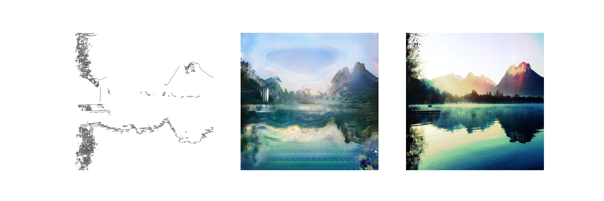

# Auto-Landscaping

Auto painting by Pix2Pix

 

* Generator에서 Dropout의 위치가 아주 중요함. Dropout을 잘못 배치했을 시, 노이즈가 가득 낀 결과물만 나오게 됨

* Image Size가 너무 크면 모델이 소화하기 어려울 수 있음. Batch size가 작아져서 Batchnorm에도 좋은 영향 X

* Lambda =100, Epoch = 500 Result

  

 

* image size=512, ConvTranspose를 grid artifact issue로 upsample+Conv layer로 대체

  

  

  - 물결치는듯한 이미지가 생성되고 skip-connection이 없는 encoder-decoder구조에서 발견되는 반복되는듯한 그림이 나타남
  - high resolution을 generator가 수용하지 못해서 생기는 퀄리티의 저하인지, architecture 구조 변경으로 인한 문제인지 확인해야 함

 

* image size=256, ConvTranspose를 upsample+Conv layer로 대체

  

  

  - image size 512와 유사한 문제가 나타남

    

* image size=512, baseline

  

  

  
  * 해상도가 높아져 이미지도 선명하나 우측 하단과 좌측 하단에 과적합으로 생긴듯한 Patch가 보임